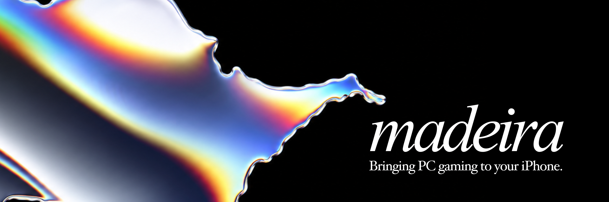

<p align="center">
  
</p>

<p align="center">
  <a href="https://discord.gg/4t5mNjwCn7"></a>
  &nbsp;&nbsp;&nbsp;
  <a href="https://github.com/willfaust/Madeira/releases"></a>
  &nbsp;&nbsp;&nbsp;
  <a href="LICENSE"></a>
</p>

Madeira runs Windows PC games on an iPhone, with no jailbreak. Games run as they
are, unmodified, inside a single iOS app.

> [!NOTE]
> Madeira is an active research project. Many games start and some play well,
> but performance and compatibility vary from game to game, and things change
> quickly. Expect rough edges.

## How it works

| Layer | What it does |
|---|---|
| **[FEX-Emu](https://github.com/FEX-Emu/FEX)** | Translates the game's x86 and x86-64 code to ARM64 as it runs. |
| **[Wine](https://www.winehq.org/)** 11.4 | Provides Windows. It is built for ARM64EC, so Wine itself runs natively and only the game's own code is translated. 32-bit games run through WoW64. |
| **[DXMT](https://github.com/3Shain/DXMT)** | Draws Direct3D 9, 10 and 11 with Metal. |
| **[madeira-d3d12](madeira-d3d12)** | Madeira's own Direct3D 12 implementation on Metal, converting DXIL shaders at run time with Apple's Metal Shader Converter. |

iOS apps cannot start other programs, so everything runs in one process: even
Wine's server runs as a thread instead of a separate program.

## Features

- **Game library** with artwork, search and a Windows desktop session.
- **Steam**: sign in, browse the games you own, install and update them, and
  start them through Valve's own Windows Steam client (Madeira Dock).
- **Controllers**: Bluetooth controllers through XInput, plus customisable
  on-screen touch controls.
- **Keyboard, mouse and trackpad** passed through to games as real input.
- **Video and audio** for cutscenes and music, through FFmpeg, VideoToolbox and AudioToolbox.

## Requirements

- An iPhone on **iOS 26 or later**, the only version Madeira currently runs
  on reliably. Development happens on recent Pro iPhones.
- **JIT**, which iOS only allows while a debugger is attached. Madeira uses
  [StikDebug](https://github.com/StikDebug/StikDebug) for this.
- An **Apple ID** to sideload the app. A free account works; its signing
  expires after 7 days, so the app needs refreshing weekly. Your games and
  saves are kept across reinstalls.

Because JIT needs a debugger, Madeira cannot be offered on the App Store.

## Installing

1. Download the IPA from the [latest release](https://github.com/willfaust/Madeira/releases).
2. Sideload it with your own Apple ID using SideStore, AltStore, Sideloadly,
   Plume or a similar tool.
3. Open Madeira and enable JIT with StikDebug.
4. In **Settings**, check that **JIT** and **Memory+** both show a green check:
   Madeira then says **Ready to play**.

Some 64-bit games need Microsoft's Visual C++ runtime, which is not included
(see [Licensing](#licensing)).

## Building from source

```sh
git clone --recurse-submodules https://github.com/willfaust/Madeira.git
```

`FEX`, `wine`, `dxmt` and `madeira-dock` are submodules that point at Madeira's
own forks; upstream checkouts will not build here. The build has several parts
(the Wine unix libraries, the ARM64EC Windows modules, FEX, DXMT and the app)
and some inputs that are not in the repository, such as the toolchains.
[`docs/BUILDING.md`](docs/BUILDING.md) walks through all of it.

### Repository layout

| Path | Contents |
|---|---|
| [`app/`](app) | The iOS app: SwiftUI front end, Wine bridge and bundled resources |
| [`wine/`](https://github.com/willfaust/wine), [`FEX/`](https://github.com/willfaust/FEX), [`dxmt/`](https://github.com/willfaust/dxmt), [`madeira-dock/`](https://github.com/willfaust/madeira-dock) | Madeira's forks and the Steam client launcher (submodules) |
| [`madeira-d3d12/`](madeira-d3d12) | The native Direct3D 12 runtime |
| [`build/`](build) | Build scripts and iOS-side sources, one folder per component |
| [`tests/`](tests) | Host checks and x86, x86-64 and DXMT test programs |
| [`tools/`](tools) | Helper scripts |
| [`docs/`](docs) | Documentation |
| [`research/`](research) | Experiments that are not part of the app |

## Documentation

| Topic | Document |
|---|---|
| Building from a clean checkout | [`docs/BUILDING.md`](docs/BUILDING.md) |
| The game library | [`docs/LIBRARY.md`](docs/LIBRARY.md) |
| Steam sign-in, library and downloads | [`docs/STEAM_SIGNIN.md`](docs/STEAM_SIGNIN.md), [`docs/STEAM_LIBRARY.md`](docs/STEAM_LIBRARY.md) |
| Madeira Dock (the Steam client) | [`docs/MADEIRA_DOCK.md`](docs/MADEIRA_DOCK.md) |
| 32-bit games (WoW64) | [`docs/WOW64.md`](docs/WOW64.md) |
| Controllers and touch controls | [`docs/CONTROLLERS.md`](docs/CONTROLLERS.md) |
| Keyboard, mouse and trackpad | [`docs/KEYBOARD_MOUSE.md`](docs/KEYBOARD_MOUSE.md) |
| Audio and video | [`docs/MEDIA.md`](docs/MEDIA.md) |
| Licensing in detail | [`docs/LICENSING.md`](docs/LICENSING.md) |

## Licensing

Madeira is licensed under **GPL-3.0-or-later** ([`LICENSE`](LICENSE)) with
the **Madeira Converter Exception** ([`LICENSE-EXCEPTION.md`](LICENSE-EXCEPTION.md)),
an additional permission that allows it to work with Apple's Metal Shader
Converter.

The projects it builds on keep their own licenses upstream, but Madeira's forks
are not all licensed the same way as their upstreams:

| Component | License |
|---|---|
| [Wine fork](https://github.com/willfaust/wine) | LGPL-2.1-or-later, like upstream Wine |
| [FEX-Emu fork](https://github.com/willfaust/FEX), [DXMT fork](https://github.com/willfaust/dxmt) | Upstream code stays MIT; Madeira's changes are GPL-3.0-or-later with the exception |
| [rpmalloc fork](https://github.com/willfaust/rpmalloc) | Upstream code stays 0BSD; Madeira's changes are GPL-3.0-or-later with the exception |
| [Madeira Dock](https://github.com/willfaust/madeira-dock) | GPL-3.0-or-later with the exception |

Anything obtained earlier under a permissive license stays available under it.
Per-component details, including GnuTLS, Nettle, GMP, FFmpeg and LLVM, are in
[`THIRD-PARTY-NOTICES.md`](THIRD-PARTY-NOTICES.md); the license texts are in
[`LICENSES/`](LICENSES).

Microsoft's Visual C++ runtime DLLs are **not** distributed with Madeira. To
build with them, supply them yourself as described in
[`tools/fetch-vcruntime.md`](tools/fetch-vcruntime.md).

## Contributing

Contributions are welcome under GPL-3.0-or-later; see
[`CONTRIBUTING.md`](CONTRIBUTING.md).

Madeira's forks contain a lot of AI-assisted work. FEX-Emu does not accept
AI-generated code, so please **do not send changes from these forks upstream**
to FEX-Emu, and check each upstream project's contribution policy before
proposing anything to it.

## Credits

- **Will Faust** ([@willfaust](https://github.com/willfaust)): created Madeira
- **Nick** ([@125hz](https://github.com/125hz)): 32-bit game support, the game library and Madeira Dock
- **Jfishin** ([@Jfishin](https://github.com/Jfishin)): the original native Steam sign-in, library and downloads

Madeira is built on [Wine](https://www.winehq.org/), [FEX-Emu](https://github.com/FEX-Emu/FEX),
[DXMT](https://github.com/3Shain/DXMT) by Feifan He (3Shain) with the Direct3D 9
frontend by David Acevedo (dacevedo12), [rpmalloc](https://github.com/mjansson/rpmalloc)
by Mattias Jansson, and [StikDebug](https://github.com/StikDebug/StikDebug)
for enabling JIT. Thank you to everyone who contributes to them.

<p align="center">
  <a href="https://discord.gg/4t5mNjwCn7"><b>Join the community on Discord</b></a>
</p>
